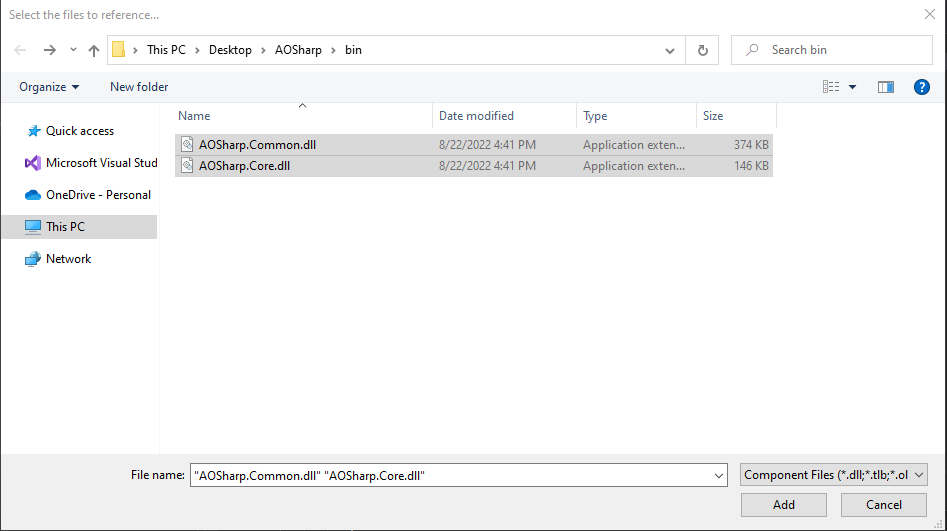

# Unofficial AOSharp Plugin Template

A [Visual Studio Project Template](https://docs.microsoft.com/en-us/visualstudio/ide/how-to-create-project-templates?view=vs-2022) that I have used while creating AOSharp plugins.

Not official or endorsed by AOSharp in any capacity. Just something I use.

### Note

Plugins and development should only take place on [TestLive](https://forums.funcom.com/t/welcome-to-testlive/6433). Use at your own risk.

### Build & Installation

Clone and build the respository, as you would any other project.

Locate the resulting "Unofficial AOSharp Plugin Template.zip" file in your \bin\ folder.

Copy this .zip file to your Visual Studio User Templates folder. By default this folder is located at "%USERPROFILE%\Documents\Visual Studio 2019\Templates\ProjectTemplates\Visual C#\"

[Additional Microsoft Documentation](https://docs.microsoft.com/en-us/visualstudio/ide/how-to-locate-and-organize-project-and-item-templates?view=vs-2022)

### Usage

#### Create a new project

Restart Visual Studio and create a new project.

Search for "Unofficial AOSharp Plugin Template" at the "Create a new project" screen. Select this entry and click "Next".

Configure your new project and click "Next".

#### Include AOSharp References

In the solution explorer, right click on "References" and click "Add Reference".

Click "Browse" in the new reference manager window.

Locate your AOSharp.Common.dll and AOSharp.Core.dll files and click "Add".

Ensure that the checkboxes to the right of the new references are selected, then click "Ok".

#### Begin Coding

At this point, you're ready to begin coding your new plugin!

Some sample code has been included to get you started off. Try compiling, adding to AOSharp, and injecting into your game. Your main chat window will give you instructions on what to do next!

### Further Support

Does not exist.